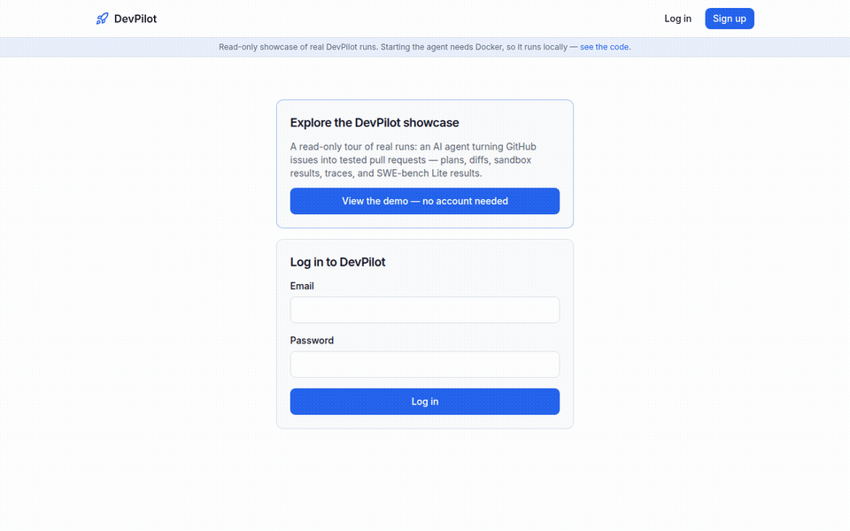
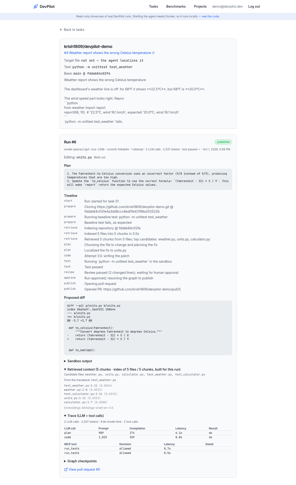
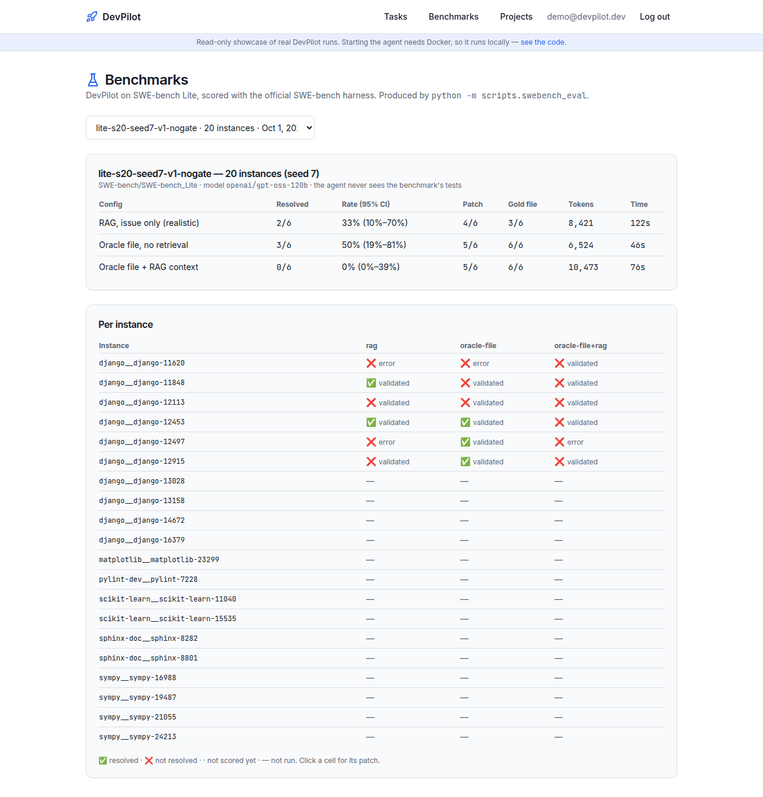
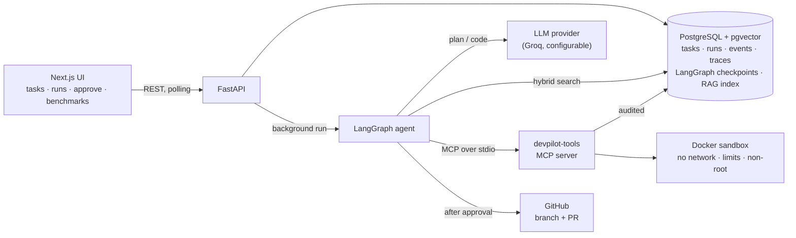
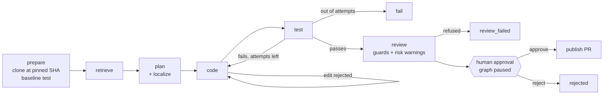

# DevPilot

**An AI software engineer that turns GitHub issues into tested pull requests — and never ships
without a human's approval.**

[](https://github.com/krish1809/devpilot/actions/workflows/ci.yml)

**[▶ Live demo](https://devpilot-pied.vercel.app)** — a read-only showcase of real runs (click
*View the demo*, no account needed; the free API server may take ~1 min to wake up).

Point DevPilot at an issue. It indexes the repository, finds the file that's actually broken,
plans a fix, edits the code, runs the project's tests in a locked-down Docker sandbox, and shows
you the diff, the plan and a full trace. Only when you click **Approve** does it push a branch and
open the pull request.

<p align="center">
  
</p>

<table>
  <tr>
    <td width="50%"><a href="docs/images/run-detail.png"></a></td>
    <td width="50%"><a href="docs/images/benchmarks.png"></a></td>
  </tr>
  <tr>
    <td align="center"><sub>One run, end to end: plan · timeline · diff · retrieved context · trace · PR</sub></td>
    <td align="center"><sub>SWE-bench Lite results, scored by the official harness</sub></td>
  </tr>
</table>

**Example:** [issue #4](https://github.com/krish1809/devpilot-demo/issues/4) only said *"the
weather report shows the wrong Celsius temperature"*. DevPilot retrieved the related code, traced
the bug past `weather.py` (the file the issue talks about) to the conversion helper in `units.py`,
fixed `5 / 8` → `5 / 9`, passed the tests in the sandbox in ~18 s using ~2.3k tokens, and — after
approval — opened [PR #5](https://github.com/krish1809/devpilot-demo/pull/5).

## Highlights

- **A durable agent, not a single prompt.** A [LangGraph](https://www.langchain.com/langgraph)
  state graph — retrieve → plan → code → test (bounded repair loop) → review → human approval →
  publish — checkpointed to Postgres after every step. Runs execute in the background, can be
  cancelled, resumed after a crash, and wait indefinitely for a decision (the paused graph
  survives a server restart). Every run is capped on attempts, LLM calls, tokens and time.
- **Untrusted code stays in a box.** Repository tests run only in a disposable Docker container:
  no network, CPU/memory/PID limits, non-root, hard timeout. Nothing from the repo runs on the host.
- **Human-in-the-loop, enforced.** An approval is bound to the SHA-256 of the exact diff and the
  base commit you reviewed; if anything changed, publishing refuses. Patches that newly add
  environment access, process execution or network calls are flagged before you approve.
- **Repository RAG.** Code is chunked (Python by top-level definitions), embedded locally
  (`bge-small`, no API key) into **pgvector**, and searched with a hybrid of vector similarity and
  Postgres full-text search (reciprocal-rank fusion, traceback boosting). Large repos are embedded
  lazily at query time. The planner uses it to *localize* the file when the issue doesn't say.
- **Its own MCP server.** The agent's sandbox runs go through `devpilot-tools`, a
  [Model Context Protocol](https://modelcontextprotocol.io) server bound per process to one run and
  a permission policy: `run_tests` only runs the task's configured command, file reads are confined
  and refuse secrets, and every call — allowed or denied — lands in an audit log.
- **Prompt-injection aware.** Issue text, files and tool output are treated as hostile: wrapped in
  untrusted-data tags, secrets never enter prompts, the agent can't be steered into `.env` or CI
  files. A test suite runs the agent against a deliberately malicious repository.
- **Evaluated, honestly.** A harness runs DevPilot on **SWE-bench Lite** and scores every patch with
  the **official SWE-bench harness**, comparing configurations (see below).
- **Inspectable.** Per-run timeline, plan, retrieved context, LLM-call trace (tokens, latency),
  MCP tool-call audit, and graph checkpoints — all in the UI.

## Results

**Retrieval matters for root-cause fixes** ([report](docs/eval/phase6-rag.md)). On 5 multi-file
repos where the issue never names the buggy file, both configurations made the tests pass, but
only retrieval fixed the *actual* bug every time:

| Config | Tests pass | Fixed the buggy file (not a workaround) | Avg tokens |
|---|---|---|---|
| No retrieval (file list only) | 5/5 | 2/5 | 2,483 |
| Hybrid RAG | 5/5 | **5/5** | 1,990 |

**SWE-bench Lite** ([method](docs/eval/README.md)) — a seeded random sample of 20 real issues
from Django, SymPy, scikit-learn, Sphinx, Matplotlib and Pylint, run with a free-tier open-weight
model (`gpt-oss-120b` on Groq, 200k tokens/day) and scored by the official harness. The full run
is in progress (it's paced by the daily token quota); reports:
[current run](docs/eval/phase7-lite-s20-seed7.md) ·
[earlier agent version, 6 instances](docs/eval/phase7-lite-s20-seed7-v1-nogate.md).
Read it as a capability demonstration with wide confidence intervals, not a leaderboard claim.

What evaluation already changed in the agent: SEARCH/REPLACE editing with excerpts for large files
(whole-file rewrites don't fit real repositories), lazy embedding (CPU embedding of a 12k-chunk repo
would take ~15 min), and a syntax gate after early patches failed on an `IndentationError` before a
single test ran.

## Architecture





## Tech stack

| Area | Technology |
|---|---|
| Backend | Python 3.12, FastAPI, Pydantic v2, SQLAlchemy 2, Alembic |
| Agent | LangGraph (+ Postgres checkpointer), provider-neutral LLM client |
| Retrieval | pgvector, Postgres full-text search, fastembed (`BAAI/bge-small-en-v1.5`, ONNX) |
| Tools | MCP Python SDK 2.x (stdio), Docker sandbox, git, GitHub REST |
| Frontend | Next.js 14, TypeScript, Tailwind |
| Quality | pytest (≈200 tests incl. a real Postgres/pgvector test DB), Vitest + Testing Library, Ruff, ESLint, GitHub Actions |
| Evaluation | SWE-bench Lite + the official `swebench` harness |

## Run it locally

Requirements: Docker, Python 3.11+, Node 20+, Git, a [Groq](https://console.groq.com) API key
(free) and, for opening PRs, a GitHub token or the authenticated `gh` CLI.

```bash
docker compose up -d postgres                 # Postgres 17 + pgvector
cd apps/api && python3 -m venv .venv && source .venv/bin/activate
pip install -e ".[dev]"
cp ../../.env.example .env                    # set GROQ_API_KEY (and GITHUB_TOKEN if no gh CLI)
alembic upgrade head
docker pull python:3.11-slim                  # the sandbox image
uvicorn app.main:app --reload                 # http://localhost:8000/docs

cd ../web && npm install && npm run dev       # http://localhost:3000
```

Sign up, open **Tasks**, import a GitHub issue (or point at any git URL), press **Run agent**,
review, approve. Checks: `make check` (backend) · `npm run lint && npm test && npm run build` (web).

Public deployment is a read-only showcase (`DEMO_MODE=true`) — see [docs/DEPLOY.md](docs/DEPLOY.md).

## Limitations (honest)

- **Single-file fixes.** The agent edits exactly one file per run (every SWE-bench Lite reference
  patch does too); multi-file changes are out of scope.
- **Free-tier model.** Patch quality is bounded by `gpt-oss-120b` on Groq's free tier and its
  200k tokens/day; stronger models would score higher. The provider is configuration.
- **Runs live in the API process** (background threads) and progress is polled — no separate
  worker or streaming yet.
- **The hosted site is a showcase.** Running the agent needs Docker and an LLM key, so it runs
  locally; the public site shows recorded runs.
- Deliberately out of scope for a portfolio project: multi-tenancy, billing, Kubernetes, a GitHub
  App ([docs/PLAN.md](docs/PLAN.md)).

## Documentation

[Walkthrough (how it all works)](docs/WALKTHROUGH.md) · [Plan & phases](docs/PLAN.md) · [Progress](docs/PROGRESS.md) · [API](docs/API.md) ·
[Security](docs/SECURITY.md) · [Evaluation](docs/eval/README.md) · [Deploy](docs/DEPLOY.md)
